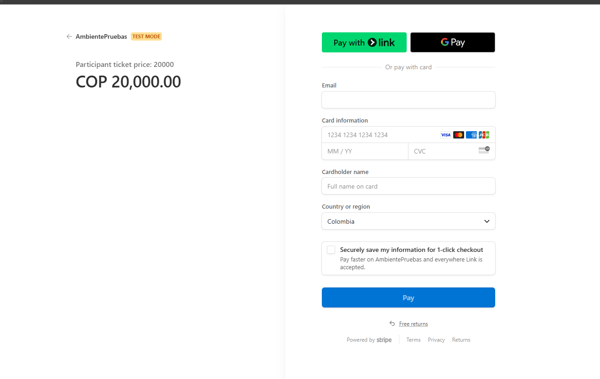
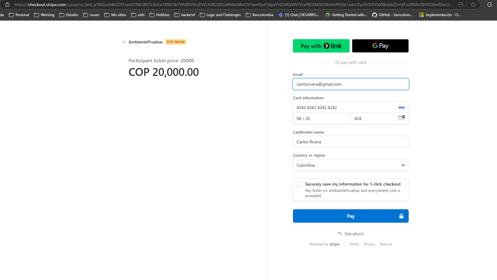
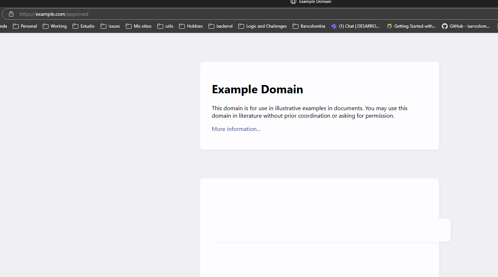
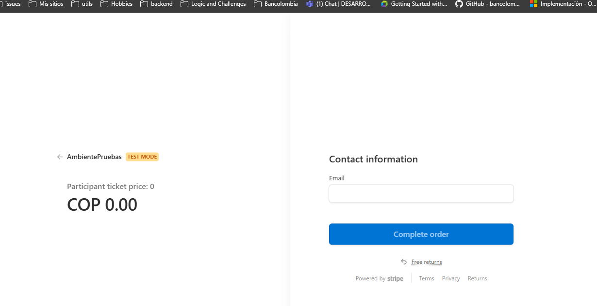
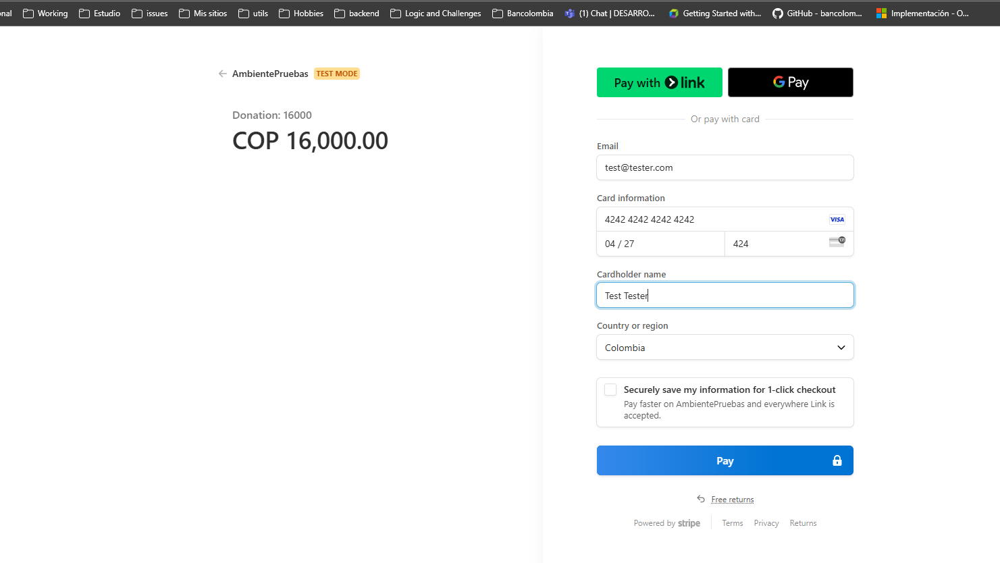

# PaymentsMS
Este proyecto gestiona todo el tema de pagos por venta de tickets o donaciones dentro del sistema, el cual cuenta con varios endpoints y cuenta con integracion con [Stripe](https://stripe.com/es)

## Requisitos Previos
- .NET 8 SDK
- PostgreSQL
- RabbitMQ Server
- Redis
- API Secret Stripe


## Estructura

- **API/Controllers/**: Contiene los controladores de la API.
- **Domain/Entities/**: Contiene los modelos o entidades de datos.
- **Application/Services/**: Contiene los servicios de la aplicación.
- **Infrastructure/Data/**: Contiene el contexto de la base de datos.
- **Infrastructure/EventBus/**: Contiene la config del event bus/rabbitmq.
- **Program.cs**: Punto de entrada del proyecto.

# Instrucciones de Ejecución
Para ejecutar el proyecto UsersAuthorization, sigue estos pasos:

- Asegúrate de tener una base de datos PostgreSQL en funcionamiento.
- Configura las variables de entorno necesarias o modifica los archivos appsettings.json, según sea necesario.
- Navega al directorio del proyecto UsersAuthorization.
- Ejecuta el siguiente comando para aplicar las migraciones de la base de datos: `dotnet ef database update`
- Ejecuta el siguiente comando para iniciar el proyecto: `dotnet run`

Esto iniciará el proyecto y estará listo para poder ser usado.

Generar Documentación con Swagger
Swagger automáticamente genera la documentación de la API. Para ver la documentación generada, inicia la aplicación y navega a http://localhost:<puerto>/swagger.

En la solucion, se hace un metodo de extension el cual va a implementar la validacion de los tokens para endpoints protegidos, los tokens se generan en el MS de Usuarios y Autorizacion, llamando al metodo de inicio de sesion, son los tokens validos dentro del sistema, en caso de que no sea proporcionado, se rechaza la peticion con un codigo de estado `401`.


***NOTA***: en el sistema los tickets tienen un precio por defecto, si el torneo es pago, un ticket para partcipante cuesta $20.000, si es espectador $5.000, por el contrario si el torneo es gratuito, el participante debe comprar un ticket, que tiene costo de $0, y ya por logica interna del sistema se le asocia la compra al usuario.


## Endpoints Controllers

### Venta tickets participantes

#### Paid
- [POST] `/api/v1/transactions/participant/sale`: este es el metodo encargado de crear una transaccion de tipo SALE(venta) en lo que concierne a la venta de ticktes para participantes.

#### Ejemplos session compra ticket: `/api/v1/transactions/participant/sale`

***Headers ***
    - **Auhotirzation**: Bearer some-token

***Body***:
```
{
  "sessionUrl": "",
  "sessionId": "",
  "approvedUrl": "https://example.com/approved",
  "cancelUrl": "https://example.com/cancel",
  "details": {
    "idTicket": 45,
    "idTournament": 5
  }
}
```
**Mandar el id del ticket valido, con respecto al torneo, esto se valida antes de hacer la session, porque los tickets se validan de manera previa para evitar ser revendido el mismo ticekts**

*Se proporcionan urls de de ejemplo, de manera inicial, sessionId y sessionURL van vacios, debido a que su valor sera reemplazada una vez se cree una sesion de pago valida en stripe y su vez cacheando en memoria el id  de la sesion y el usuario en redis, para despues proceder a validar el pago y hacerlo efectivo dentro de la base de datos, en un flujo completo, cuando stripe tiene un pago exitoso, redirige al approvedUrl que seria dentro de la misma plataforma con una interfaz grafica, por efectos de tiempo, no hubo tiempo :c, asi que se coloca una url de ejm, lo idea, es que una vez redirija al approved, se llame la api de validacion de estado del pago*,

***Respuesta***:
```
{
    "result": {
        "sessionUrl": "https://checkout.stripe.com/c/pay/cs_test_a1RKbiz04k2Z9TuekIONb3B9TLBsEw1RBXJlbY9A8RV9LijPVZUUB2QfUa#fidkdWxOYHwnPyd1blpxYHZxWjA0VHYxPXFXN0tGNUtmPEFtb1xdcU5pVU5IVVxXRkxkblZmVjFzcXN9c2BVVGBwR0xrUHFrd3w1aV98MTJ1bk9UblJKYEAwS39CPHdoTkpXbXc3M0ptUE1VNTU1X393b2RCXScpJ2N3amhWYHdzYHcnP3F3cGApJ2lkfGpwcVF8dWAnPyd2bGtiaWBabHFgaCcpJ2BrZGdpYFVpZGZgbWppYWB3dic%2FcXdwYHgl",
        "sessionId": "cs_test_a1RKbiz04k2Z9TuekIONb3B9TLBsEw1RBXJlbY9A8RV9LijPVZUUB2QfUa",
        "approvedUrl": "https://example.com/approved",
        "cancelUrl": "https://example.com/cancel"
    },
    "message": ""
}
```
* Una vez obtenida la respuesta se ahce uso de la sessionUrl y se abre en el navegador, lo que cargara lo siguiente:



Al ser un ambiente de pruebas Sandbox, no hace realmente pagos y validaciones actualmente, en el email se coloca cualquier correo(no debe ser valido, lo usa stripe para despues enviar notificacion en ambientes productivos), la tarjeta se puede usar la siguiente: `4242 4242 4242 4242`, en la fecha de vencimiento tener en cuenta que no debe ser fecha expirada(`04 / 26`),  y el codigo `424`



Despues de darle pagar, se valida el pago en Stripe, como es ambiente Sandbox con de prueba redirige a la url de aprobacion del banco.




**Una vez realizado el pago dicha session de pago, se almacena en Redis, para despues obtener la info tanto del usuario, para poder realizar el pago, una vez se hace exitossamente, se procede a borrar la llave de la memoria, de otro modo tocaria crear una forma de tener el usuario, cabe notar que los usuarios, si se asocian a una donacion o a una venta, pero las transacciones, no tienen un usuario, debido a que las transacciones se asocian directamente a las donaciones o  las ventas una vez completadas**

Para validar el estado del pago, o confirmarlo se hace uso del siguiente endpoint:

- [POST] `/api/v1/transactions/status`

***Headers***:
    - **Authorization**: Bearer some-token

***Body***:
```
{
  "sessionId": "cs_test_a1RKbiz04k2Z9TuekIONb3B9TLBsEw1RBXJlbY9A8RV9LijPVZUUB2QfUa",
  "transactionType": "SALE"
}
```
En el body, se manda lo que es el sessionId que se genera en la peticion previa, de modo que se manda una session existente a validar, ademas, el tipo de transaccion, que es un enum el cual acepta uno de los siguientes valores: `SALE`, `DONATION`, en este caso, es una venta, asi que se manda el param `SALE`

Si se pasan datos correctos, esta es la respuesta esperada:

```
{
    "result": {
        "sessionId": "cs_test_a1RKbiz04k2Z9TuekIONb3B9TLBsEw1RBXJlbY9A8RV9LijPVZUUB2QfUa",
        "status": "succeeded"
    },
    "message": ""
}
```

#### Free

Cuando el torneo es gratuito, los tickets se venden de manera gratuita(segun yo), es decir, se venden por $0

- [POST] `/api/v1/transactions/participant/sale`

***Headers***:
    - **Authorization**: Bearer some-token

***Body***:
```
{
  "sessionUrl": "",
  "sessionId": "",
    "approvedUrl": "https://example.com/approved",
  "cancelUrl": "https://example.com/cancel",
  "details": {
    "idTicket": 12,
    "idTournament": 2
  }
}
```

***Respuesta***:
```
{
    "result": {
        "sessionUrl": "https://checkout.stripe.com/c/pay/cs_test_a13B0TmZj3VJcsRfkgaLTIr3HrKVy9zJRqrlERjlNfrGud3TGkGoP2YqsX#fidkdWxOYHwnPyd1blpxYHZxWjA0VHYxPXFXN0tGNUtmPEFtb1xdcU5pVU5IVVxXRkxkblZmVjFzcXN9c2BVVGBwR0xrUHFrd3w1aV98MTJ1bk9UblJKYEAwS39CPHdoTkpXbXc3M0ptUE1VNTU1X393b2RCXScpJ2N3amhWYHdzYHcnP3F3cGApJ2lkfGpwcVF8dWAnPyd2bGtiaWBabHFgaCcpJ2BrZGdpYFVpZGZgbWppYWB3dic%2FcXdwYHgl",
        "sessionId": "cs_test_a13B0TmZj3VJcsRfkgaLTIr3HrKVy9zJRqrlERjlNfrGud3TGkGoP2YqsX",
        "approvedUrl": "https://example.com/approved",
        "cancelUrl": "https://example.com/cancel"
    },
    "message": ""
}
```

Es un poco diferente al proceso anterior, debido a que la pantalla ya no solicita informacion de pago, sino, simplemente completar el pedido con el correo, al darle completar el pago, redirige al approved: 




Una vez realizado el pago, se debe llamar la api de validacion al igual que el ejeemplo anterior

- [POST] `/api/v1/transactions/status`

***Headers***
    - **Authorization**: Bearer some-token

***Body***:
```
{
  "sessionId": "cs_test_a13B0TmZj3VJcsRfkgaLTIr3HrKVy9zJRqrlERjlNfrGud3TGkGoP2YqsX",
  "transactionType": "SALE"
}
```

***Respuesta esperada***:
```
{
    "result": {
        "sessionId": "cs_test_a13B0TmZj3VJcsRfkgaLTIr3HrKVy9zJRqrlERjlNfrGud3TGkGoP2YqsX",
        "status": "succeeded"
    },
    "message": ""
}
```


### Donaciones

#### donation
Para la realizacion de donaciones en el sistema se hace el uso del siguiente endpoints

- [POST] `/api/v1/transactions/donation`

***Headers***:
    - **Authorization**: Bearer some-token

***Body***:
```
{
  "sessionUrl": "",
  "sessionId": "",
  "approvedUrl": "https://example.com/approved",
  "cancelUrl": "https://example.com/cancel",
  "idTournament": 5,
  "amount": 16000
}
```
***Respuesta:***
```
{
    "result": {
        "idTournament": 5,
        "amount": 16000,
        "sessionUrl": "https://checkout.stripe.com/c/pay/cs_test_a1YAODtsSyZIAvDSsyxRljgw3qb8VksX479bZelw352EnBDPI1GM9tnelv#fidkdWxOYHwnPyd1blpxYHZxWjA0VHYxPXFXN0tGNUtmPEFtb1xdcU5pVU5IVVxXRkxkblZmVjFzcXN9c2BVVGBwR0xrUHFrd3w1aV98MTJ1bk9UblJKYEAwS39CPHdoTkpXbXc3M0ptUE1VNTU1X393b2RCXScpJ2N3amhWYHdzYHcnP3F3cGApJ2lkfGpwcVF8dWAnPyd2bGtiaWBabHFgaCcpJ2BrZGdpYFVpZGZgbWppYWB3dic%2FcXdwYHgl",
        "sessionId": "cs_test_a1YAODtsSyZIAvDSsyxRljgw3qb8VksX479bZelw352EnBDPI1GM9tnelv",
        "approvedUrl": "https://example.com/approved",
        "cancelUrl": "https://example.com/cancel"
    },
    "message": ""
}
```

De igual manera que en el endpoint de realizacion de pagos, se usa la url de la session para poder hacer el respectivo pago de acuerdo a lo propuesto en la donacion, llenando los campos como se muestra a continuacion:


                ***Como se logra apreciar, se muestra la cantidad, y el item que es `Donation`***

#### validate donation
Al igual que en las ventas de tickets, se debe hacer la respectiva validacion de la donacion, para registrarla en el sistema, se hace el uso del endpoint de validacion de estado, en donde se envia el sessionId generado previamente, y cambiando el tipo de parametro a `DONATION`, como se muestra a continuacion:

- [POST] `/api/v1/transactions/status`


***Headers***:
    - **Authorization**: Bearer some-token

***Body***:
```
{
  "sessionId": "cs_test_a1YAODtsSyZIAvDSsyxRljgw3qb8VksX479bZelw352EnBDPI1GM9tnelv",
  "transactionType": "DONATION"
}
```

***Respuesta***:
```
{
    "result": {
        "sessionId": "cs_test_a1YAODtsSyZIAvDSsyxRljgw3qb8VksX479bZelw352EnBDPI1GM9tnelv",
        "status": "succeeded"
    },
    "message": ""
}
```


***NOTAS***:

- en la solucion se contemplo, que los usuarios, tienen la opcion de que hubiera participantes y espectadores, en donde los participantes, compran tickets para el torneo, con ellos pueden acceder a los eventos/partidos del torneo, mientras que los espectadores, compran tickets  para ver las transmision de los eventos

- Una vez el pago es confirmado, en el caso de la venta de tickets se hace consumo del EventBus con RabbitMQ, para mandar el evento de venta del ticket, en donde se asocia el ticket al usuario, ademas, de que se envia la informacion asociada al ticket, a traves del correo, para el usuario tener la respectiva informacion.


- en caso de que el pago no sea realizado, retornara el siguiente error con codigo de estado `400`:

```
{
    "result": null,
    "message": "Payment processing error"
}
```

- en caso de que el tipo de transaccion no este relacionado, al tipo de confirmacion que se esta tratando de hacer, arrojara el siguiente error de negocio con codigo `400`:
```
{
    "result": null,
    
    -`match.info"`
    "message": "Transaction type is not valid"
}
```


## RabbitMQ/LavinMQ

### Colas de procesamiento sincrono(request/reply): 
- `ticket.user.tournament`: cola usada para validar si el usuario tiene tickets  ya asociados al mismo torneo, para evitar duplicidad de los datos, una vez ya hay una compra confirmada

- `tournament.by_id`: para obtener informacion basica respecto al torneo, sabiendo si es de pago o no, para generar las sesiones de pago con precio para el caso de tickets

- `match.info`: validar informacion del partido, determinando si existe o no, para poder realizar la creacion de la sesion de pago respectiva.

- `ticket.info`: para validar la informacion del ticket y realizar la validacion de si se encuentra disponible para la venta.


### Colas de procesamiento asincrono:

- `ticket.viewer.sale`: de manera general, los tickets de espectadores, no estan creados en la db, por lo que se realiza el envio de un evento para poder realizar la creacion y asociacion de la venta al usuario, con el respectivo envio de la informacion del ticket a traves del correo.

- `ticket.participant.sale`: para generar la asociacion de la venta del ticket al usuario en la db, y posteriormente realizar el envio del correo

- `team.assign`: para realizar el emparejamiento por defecto en el sistema a un equipo, el sistema los asigna de manera aleatoria, por medio de un evento publicado al eventbus.

- `donation.email`: para enviar confirmacion de la donacion por medio del correo, ya sea que se proceso exitosamente o hubo algun error